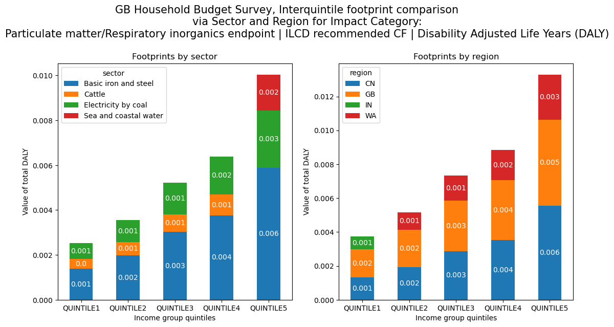
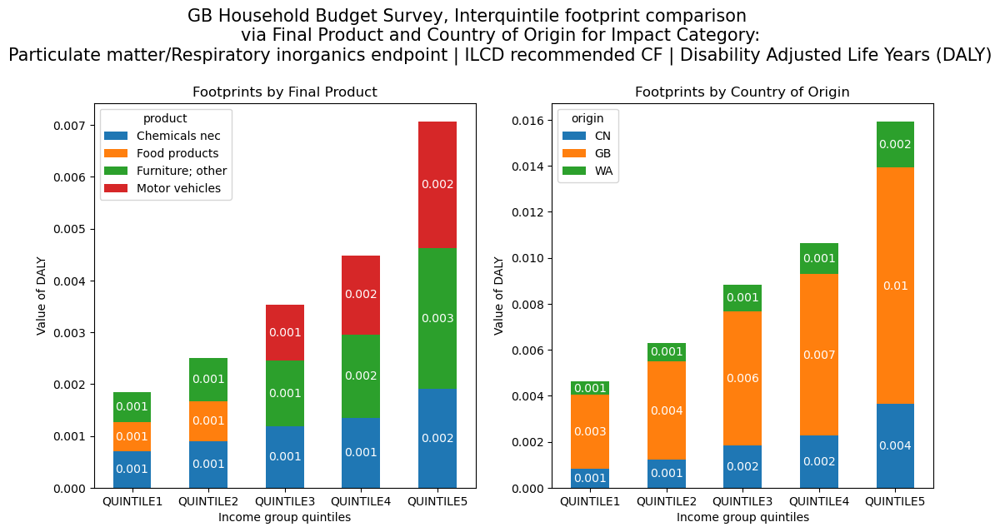
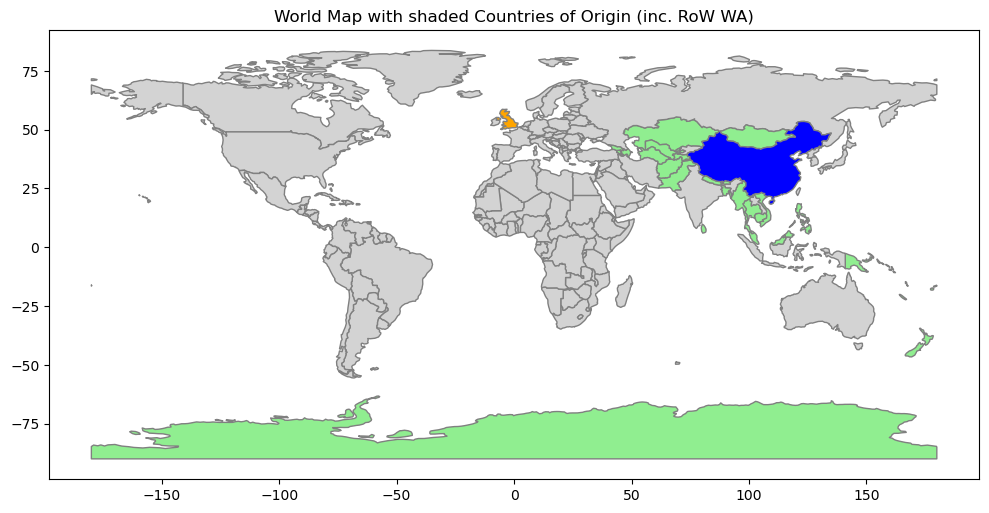

# HBS/COICOP Supply-Chain Footprint Analysis (pymrio)
Interquintile footprint comparison and analysis for Great Britain.

Eurostat provides annual data on Household Final Consumption expenditure broken down by COICOP categories and by certain cross-sectional variables.

__Results__
---
Total footprints:

Footprints by source:

$$\text{Fpt}_{\text{source}} = S \cdot \text{diag}(X) = S\cdot \text{diag}(L\cdot Y)$$
whereby X is the total industrial outputs. Here we need to iterate group-wise.

Footprints by final product:
$$\text{Fpt}_{\text{product}} = S\cdot L \cdot \text{diag}(Y)$$

Visualization (approximate) of RoW area:
