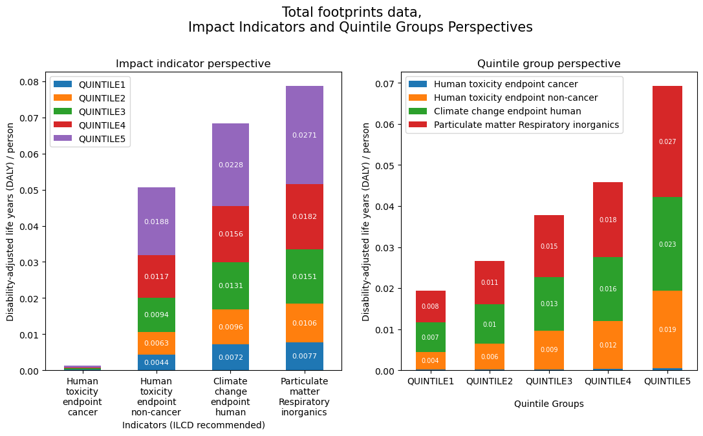

# HBS/COICOP Supply-Chain Footprint Analysis
Interquintile footprint comparison and analysis for GB

Eurostat provides annual data on Household Final Consumption expenditure broken down by COICOP categories and by certain cross-sectional variables.

